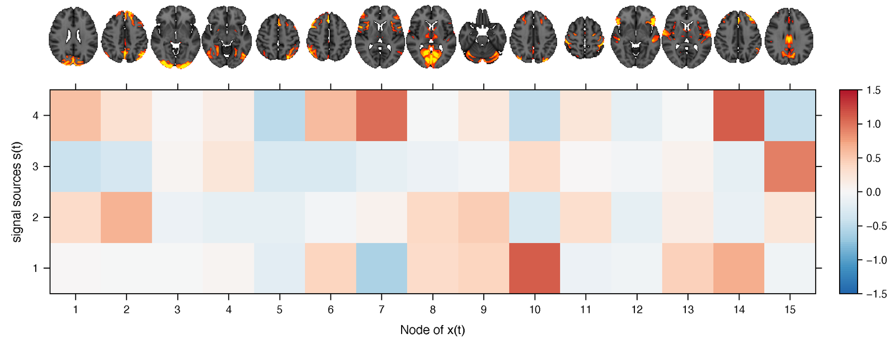
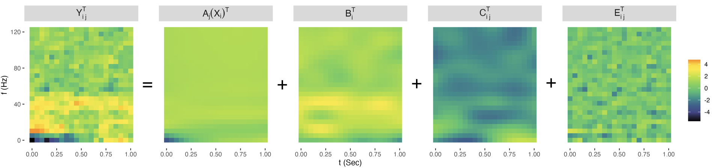
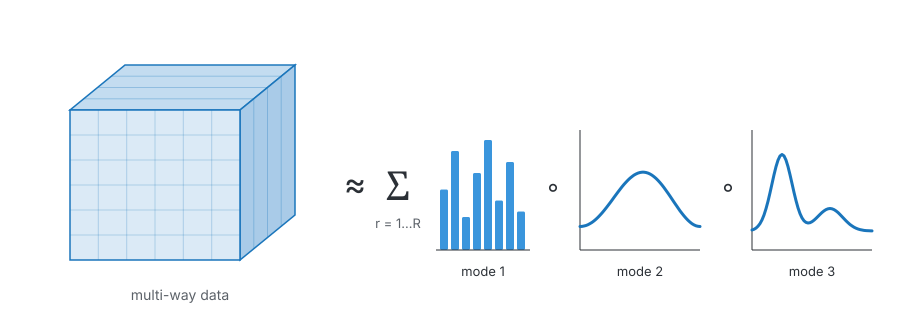
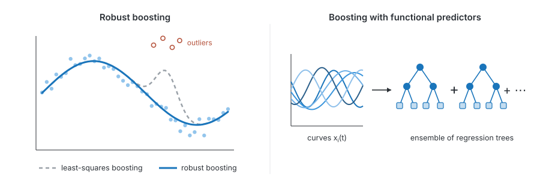

My research develops **statistical methods for complex, structured data**, including functional data, matrices, and tensors, motivated by questions in neuroimaging and precision medicine.

## Bayesian methods for neuroimaging data

### Brain networks and connectivity matrices

Functional connectivity describes how activity in different brain regions co-varies, giving each subject a symmetric positive-definite matrix.
I develop regression models that use these matrices as predictors of cognitive or clinical outcomes while respecting their geometry, and that identify the sub-networks of brain regions driving the association.
A related line of work clusters subjects by their connectivity or covariance matrices.

{fig-alt="Brain slices for 15 network nodes above a heatmap of node loadings on four latent sub-networks"}

::: {.related}
Related: [Bayesian scalar-on-network regression](https://doi.org/10.1093/biomtc/ujaf023) · [Projection-pursuit Bayesian regression](https://doi.org/10.1016/j.jmva.2025.105539) · [K-Tensors](https://arxiv.org/abs/2306.06534)
:::

### Functional and time–frequency data

EEG experiments record brain activity as surfaces over time and frequency, measured for each subject under several experimental conditions.
I develop Bayesian mixed-effects models for such multilevel two-way functional data, which separate population-level effects of conditions and covariates from subject- and trial-level variation.

{fig-alt="Five time-frequency heatmaps showing Y equals A plus B plus C plus E"}

::: {.related}
Related: [Bayesian mixed-effects models for two-way functional data](https://arxiv.org/abs/2507.20092) · [Application to chronic pain](https://pubmed.ncbi.nlm.nih.gov/40585147/)
:::

### Multi-way tensor data

Many neuroimaging studies produce data indexed along several dimensions at once, which are naturally represented as multi-way arrays, or tensors.
I am developing probabilistic models that summarize such data through a small number of interpretable components, with full uncertainty quantification.

{fig-alt="Schematic of a three-way array approximated by a sum of components, each the product of three factors"}

## Boosting for complex data

I develop gradient boosting algorithms that are robust to outliers and that handle functional predictors, with implementations in open-source R packages.

{fig-alt="Left: scatter plot with outliers where a dashed least-squares fit bends toward the outliers and a solid robust fit follows the main trend. Right: several curves feeding into a sum of small regression trees."}

::: {.related}
Related: [RRBoost (robust boosting)](https://doi.org/10.1016/j.csda.2020.107065) · [TFBoost (tree-based boosting for functional data)](https://doi.org/10.1007/s00180-023-01364-2) · [Ph.D. thesis](https://open.library.ubc.ca/soa/cIRcle/collections/ubctheses/24/items/1.0418448)
:::

## Software

| Package | Description |
|:--|:--|
| [BMEF](https://github.com/xmengju/BMEF) | Bayesian mixed-effects models for multilevel two-way functional data (R) |
| [RRBoost](https://github.com/xmengju/RRBoost) | Robust gradient boosting algorithms (R) |
| [RTFBoost](https://github.com/xmengju/RTFBoost) | Tree-based boosting for functional regression and robust variations (R) |
